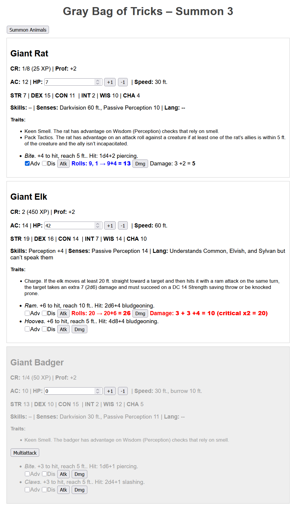

# GrayBagOfTricks

A simple PHP + JSON web app that “summons” three random beasts from the D&D Gray Bag of Tricks so you can manage their actions without slowing down the game. 
Click the button to roll d8 (×3), look up each beast’s full stat block, and manage combat rolls (attack & damage with normal/adv/dis, crits & fails, HP tracking).
Based on D&D 5th Ed (2014)

## Screenshot and demo
Check out the live demo here: [Gray Bag of Tricks Demo](https://graybagoftricks.com/)

## Features

- **Summon 3 random beasts** per click  
- Full stat block display:
  - Armor Class, Hit Points (with adjustable current HP)
  - Speed, Ability Scores (STR/DEX/CON/INT/WIS/CHA)
  - Skills, Senses, Languages, Challenge & Proficiency
  - Traits & Multiattack support
- **Attack rolls**:
  - Normal / Advantage / Disadvantage
  - Natural 20 → **bold red critical**, doubles damage
  - Natural 1 → **bold yellow fail**
- **Damage rolls** with breakdown and bolded final total  
- HP +/– buttons; auto–gray out when HP ≤ 0  
- Responsive, text‑focused UI with buttons that work on an iPad

## Installation

1. Clone or copy both files into your web root (e.g. `/var/www/html/`).  
2. Ensure your server serves `.json` as `application/json`.  
3. Point your browser to `default.php`.

## Usage

1. Open `gray_bag.php` in browser.  
2. Click **Summon Animals**.  
3. Three beasts appear with full stat blocks.  
4. Use the **+1 / –1** buttons or edit the HP input to track damage.  
5. For each attack:
   - Check **Adv** or **Dis** 
   - Click **Atk** to roll d20 and add bonuses  
   - Click **Dmg** to roll damage (dX+dY, doubled on crit)  
   - Results show in bold and color‑coded.

## Credit
Chat-GPT was used to help fascilitate this code.

